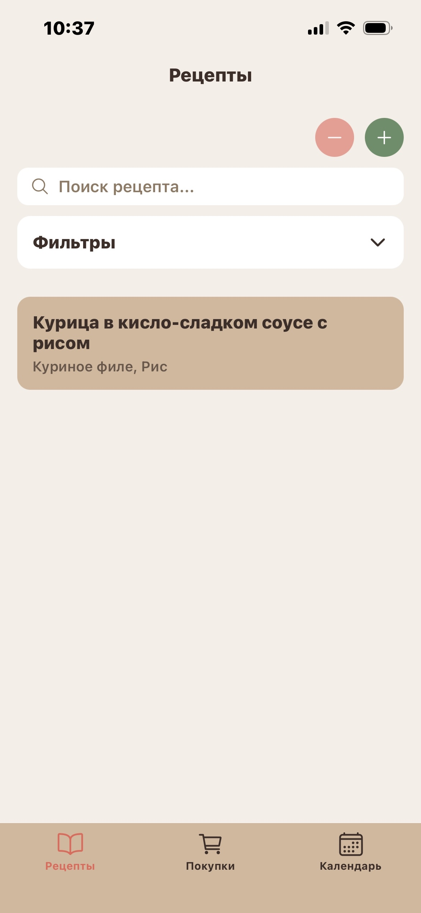
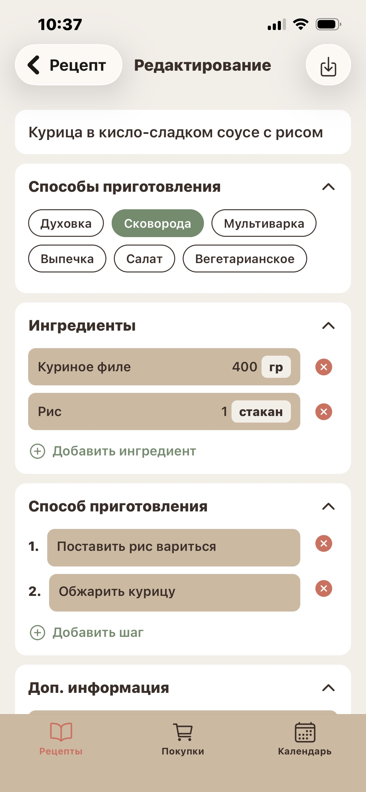
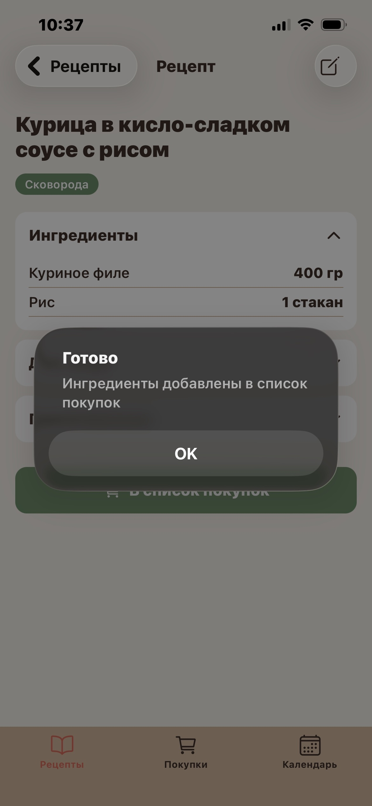
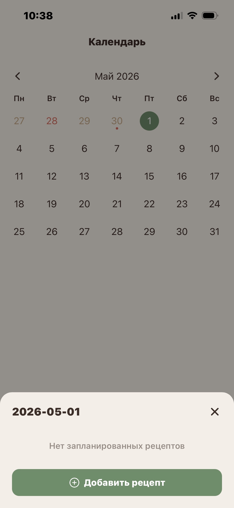

# Рецепты — мобильная кулинарная книга

Мобильное приложение-помощник на кухне: храните рецепты, собирайте список покупок и планируйте, что готовить, прямо в календаре. Все данные хранятся **локально на устройстве** — без аккаунтов, без интернета, без сервера.

Сделано на **React Native + Expo** — одна кодовая база работает и на телефоне, и в браузере.

## Возможности

- 📖 **Рецепты** — добавление, просмотр, редактирование и удаление; поиск по названию и фильтрация по тегам.
- 🛒 **Список покупок** — ручное добавление продуктов и автоматический импорт ингредиентов из рецепта одной кнопкой.
- 📅 **Календарь** — планирование рецептов на любую дату.
- 🏷️ **Свои фильтры** — можно добавлять и удалять любые теги под свои нужды.
- 🍎 **Подсчёт калорий и БЖУ** — *по желанию*. Функция выключена по умолчанию и включается в «Ещё → Настройки → Питание». Когда включена, у рецепта показывается пищевая ценность на блюдо и на порцию (с пометкой «приблизительно», если данных по части ингредиентов нет); когда выключена — в приложении нет ни одного упоминания калорий.
- ⚙️ **Настройки** — язык интерфейса (🇷🇺 RU / 🇬🇧 EN), система мер и переключатели питания.

## Скриншоты

| Список рецептов | Редактирование |
|:---:|:---:|
|  |  |

| Рецепт → в список покупок | Календарь |
|:---:|:---:|
|  |  |

## Стек

- **React Native + Expo** (SDK 54)
- **TypeScript**
- **React Navigation** — нижние вкладки + стек-навигация
- **AsyncStorage** — локальное хранилище (на вебе — `localStorage`)
- **react-native-calendars** — календарь с русской локализацией

## Запуск

```bash
# установка зависимостей (один раз)
npm install

# запуск (QR-код для Expo Go)
npx expo start

# только веб-версия
npx expo start --web
```

## Лицензия

Распространяется по лицензии **[PolyForm Noncommercial 1.0.0](LICENSE)**: разрешено свободное некоммерческое использование, изучение и доработка с указанием авторства. Любое коммерческое использование или монетизация — только с разрешения автора.

© 2026 koitorra
